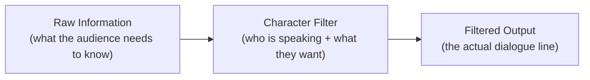
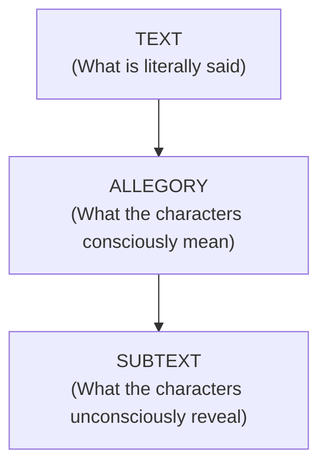
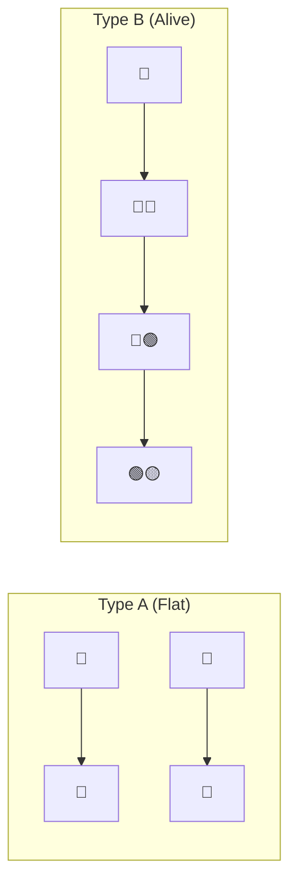

# Dialogue Masterclass — Full Analysis & Application Guide

> Source: [Better Dialogue.md](file:///c:/Users/John%20Reniel/sari-saring-katha/docs/misc/Better%20Dialogue.md)

---

## 1. The Core Philosophy: Dialogue's Place in the Order of Operations

The speaker establishes a **strict hierarchy** of writing craft. Dialogue is the **last** thing you should worry about — not because it's unimportant, but because every layer before it *shapes* what the dialogue can be:

```
1. Central Idea (Theme)
2. Characters (Who they are, what they want)
3. Conflict (What stands in their way)
4. Scenes (Blocks of time at specific locations)
5. Dialogue ← Dead last
```

> [!IMPORTANT]
> **Key insight**: If your dialogue feels weak, the problem is almost certainly upstream. Go back to your characters, their conflicts, or the scene construction before touching the words.

### What This Means for Sari-Saring Katha

Before writing a single line for Kuya Kap, Manang Ana, or T.K., ensure you've answered:

- What is this character's **central want** in this scene?
- What **conflict** is present (even if small)?
- What **information** must the audience learn from this scene?

---

## 2. The "Information Through a Human Filter" Model

This is the **single most important concept** in the entire transcript. It's the speaker's core mental model for all dialogue writing.

### The Model



**Step 1** — List all the information the scene must communicate:

- Factual (names, dates, world-building, lore)
- Emotional (how characters feel)
- Relational (how characters relate to each other)
- Cultural (world context, norms, traditions)

**Step 2** — Define the character filter:

- Not a one-word personality descriptor ("funny", "arrogant")
- Instead: **what does this character want in this scene, and how would their wording reflect that?**

**Step 3** — Pass each piece of information through the filter:

- The character's priorities distort, color, hide, or reshape the raw information
- The audience decodes the gap between what's said and what's meant

### The Philip & Keema Demonstration

The speaker builds a full scene live. Here's the information list:

| Information | Type |
|---|---|
| It's the year 2097 | Factual/World |
| Philip is picking up his belongings | Factual/Plot |
| They dated for 6 months | Relational |
| Philip was selected for a one-way trip to Icarus | Factual/Plot |
| Philip is enthusiastic about the mission | Emotional |
| Philip doesn't care about the relationship | Emotional |
| Keema is heartbroken | Emotional |

#### Bad Version (No Filter)
>
> "Hello Keema I am here to pick up my belongings from your flat also it is the year of Our Lord 2097."

Every piece of data is stated directly. It sounds **robotic** because there is no human filter.

#### The Filters Defined

| Character | Filter (Priority/Want) |
|---|---|
| **Philip** | Avoidant. Doesn't confront negative emotions. Wants to ride the high. Snaps when things get dramatic. Deeply unhealthy Enneagram 7. |
| **Keema** | Has been suppressing emotions throughout the relationship because she knows expressing them would scare him off. Now it's the last time. She's about to explode. |

#### Good Version (With Filters)

Every line is shaped by the filter:

| Line | What It Communicates | How the Filter Shaped It |
|---|---|---|
| "Hey" / "Hey" | Tone of the relationship | Minimal, guarded. Says everything about their dynamic without saying anything. |
| "Got it all together in the living room" | Why Philip is here + Keema's personality | Keema is **still doing kind gestures**. She organized his stuff. This is how she expresses love. |
| *walks past her* "Thanks Kim" | Philip's avoidance | Appreciative but not the way she wants. No eye contact. Shortened her name. Distance. |
| Philip's Icarus monologue | Year 2097, mission details, one-way trip | He's rattling off facts because **that's what's on his mind**. The exposition is purposeful because it reveals his priority. |
| "How's your mom?" | Their shared history, her emotional strategy | She's injecting sentimentality. Trying to guide the conversation toward closure without demanding it. |
| "She's supportive" | His boundary | Blunt shutting-down. Subtextually saying: "the correct way for you to respond is to support me." |
| "I'm great. How are you?" / "I'm good" | Emotional falseness on both sides | Neither is telling the truth, but for different reasons. |
| "I just wanted you to say goodbye" | Her real need | After multiple attempts, she finally breaks through her own filter. |
| "I did" | His avoidance at its peak | He technically did say goodbye. He's retreating into technicality. |
| "Not like — I want you to hug me and kiss me and mope with me" | Her explosion | The filter finally breaks. Raw truth. The suppression is over. |
| "How is that gonna make this easy?" | His worldview exposed | He reveals that his goal is ease, not authenticity. |
| "I don't want it to be easy. I just want it to be real." | The scene's thesis | The thematic statement emerges organically from conflict. |

> [!TIP]
> **The "filter" is not the character's personality adjective.** It's their **priority** and **strategy** in the moment. "Funny" is useless. "Trying to keep things light because confrontation terrifies him" is a filter.

---

## 3. Scene Architecture for Dialogue

### Scenes Are Containers, Not Vibes

The speaker learned this adapting a novel into a screenplay: the original had 20 paragraphs of beautiful prose, but only 1 in 20 communicated something **actually happening on the timeline**.

> **If information is not communicated within the confines of a scene, it is not communicated at all.**

A scene is:

- A **block of time**
- At a **specific location**
- With **specific characters**
- Containing **action and/or dialogue**

### The Bag Timer Device

In the Philip/Keema scene, the speaker uses Philip packing bags as a **physical timer**:

```
Four bags left → Three left → Two left → One left → NOW she has to say it
```

This creates:

- **Tension** (a ticking clock)
- **Justification** for why Philip stays in the room
- **Visual storytelling** (the camera keeps cutting to the bags)
- An **organic deadline** for emotional escalation

> [!TIP]
> **Application to SSK**: Your sari-sari store is FULL of natural timers — customers in a queue, products being bagged, the day progressing customer-by-customer. Use these as scene pressure devices.

---

## 4. Exposition is NOT Inherently Cringe

The speaker explicitly pushes back against the "show don't tell" and "exposition is bad" dogma:

> "If the character/device disclosing that exposition would do it, then it's not a problem."

Philip rattling off Icarus mission facts **is exposition**, but it works because:

1. He **would** talk about this — it's his obsession
2. The exposition reveals his priorities (mission over relationship)
3. It gives the scene **contrast** — he's excited while she's heartbroken

### The Rule

Exposition is fine when:

- ✅ The character would naturally say it given their filter
- ✅ The act of saying it reveals character (priorities, obsessions, deflection)
- ❌ A character says it purely for the audience's benefit with no in-universe reason

---

## 5. The "Alley-Oop Line" Anti-Pattern

### What It Is

A line that exists **only** to set up the next (meaningful) line. It's usually a random question asked at an unnatural time.

### Examples from the transcript

| Alley-Oop (Bad) | Why It's Bad |
|---|---|
| "Why'd you stick your neck out for me?" | Random, unprompted. Why is this being asked right now? |
| "The cloud operations, the temporal pencil… oh, yours?" | Unnatural phrasing. Nobody talks like that. "Do missions belong to people?" |

### Why It Matters

- These lines turn a **character into a device** for a split second
- They break the **illusion of natural progression**
- They fudge **cause and effect** — the Writer's hand becomes visible

### Solutions

| Solution | How It Works |
|---|---|
| **Delete the setup line** | If the character is already in a "bean spilling mood," they don't need a prompt. Just let them talk. |
| **Create a plot situation** | Instead of having someone *ask* about ideology, create a conflict where stating their ideology benefits them. (The Silco/Arcane example.) |
| **Use conflict as the trigger** | An underling is hesitant → the boss must persuade → persuasion reveals ideology naturally. |

> [!WARNING]
> **The fix for alley-oop lines is almost always upstream** — in the plot or scene construction, not in the dialogue itself. If you need an alley-oop, your scene design probably needs work.

---

## 6. Conflict is the State Where Characters Reveal Themselves

### Disagreement ≠ Conflict

| Type | Example |
|---|---|
| **Disagreement** | Character A hates Hawaiian pizza. Character B loves it. |
| **Conflict** | It's time to order pizza. Now they must resolve the disagreement. |

The difference: **plot**. A disagreement becomes a conflict when the characters are placed in a situation where the disagreement has material consequences.

### The Escalation Ladder

The speaker presents a brilliant escalation model:

```
Level 1: Unprompted banter about Hawaiian pizza (no stakes)
Level 2: Argument about what to order (mild stakes)
Level 3: Argument while on the phone with the pizza guy (time pressure)
Level 4: Argument while on the phone with the pizza guy while fixing a busted water pipe (chaos)
```

> [!TIP]
> **For SSK**: Your store is perfect for Level 3-4 dialogue. Characters argue about prices WHILE another customer is waiting. An important event happens WHILE Manang Ana is finally opening up. A sudden rush of customers happens MID-transaction with Kuya Kap. Layer your events.

### What Else Is Happening?

If a dialogue scene feels like it's happening **in a void**, ask:

> "What else is happening in this scene besides dialogue?"

If the answer is **nothing**, make something happen. The dialogue can interact with:

- The **location** (the store, the shelves, the refrigerator)
- The **props** (products, the phone, the transaction tray)
- **Other characters** (customers waiting in queue)
- **Events** (Mayari's collection, Uncle Mario's delivery, time of day)

---

## 7. Subtext — The Audience as Active Decoder

### Three Layers of Communication



### The Wire Chess Scene (Example)

- **Text**: D'Angelo, Bodie, and Mike talk about chess
- **Allegory**: The characters themselves are using chess as a metaphor for the drug game (this is deliberate IN-UNIVERSE)
- **Subtext**: How each character responds to the allegory reveals their worldview — "Pawns man, in the game they get capped quick… unless they some smart-ass pawns"

### Props as Idea Containers

You can **imbue objects with meaning**, and then when characters express attitudes toward those objects, they're actually expressing attitudes toward the ideas.

| Technique | How It Works |
|---|---|
| **Memorial objects** | A deceased loved one's keepsake. Characters interact with it to process grief without naming it. |
| **Charged props** | An object that stands in for an abstract concept. When characters argue about the object, they're arguing about the concept. |

### The Power of Restraint

When you consistently use subtext, props, location, and layers… the rare moment when you strip all that away and put **two characters alone in a void** becomes **massive**:

> "The absence of other variables will itself become a variable that tells the audience: hey, you can't look away this time. This moment is big and absolute."

---

## 8. "Yes, And" — The Conversation Mutation Principle

Borrowed from improv, this is about keeping dialogue alive:

### Type A Conversation (Stale)

```
Line → Response
Line → Response
Line → Response
```

Each line only addresses the previous line. No new information enters. The conversation is **closed**.

### Type B Conversation (Alive)

```
Line [idea A] → Response [addresses A + introduces B]
Line [addresses B + introduces C] → Response [addresses C + introduces D]
```

Each response **duplicates** (acknowledges the previous idea) **then elaborates** (adds something new). The ideas are "offset" — overlapping but never perfectly aligned.

### Visual Model



### Example from the Philip/Keema Scene

> **Keema**: "I'm not trying to stop you"  
> **Philip**: "Yes you are. You're gonna cry and you're gonna beg me to stay here with you."

Philip doesn't just respond — he **projecting forward**, adding his assumption of what she'll do next. This forces Keema to respond to something she hasn't even done yet, which keeps the scene **impossible to disengage from**.

> [!TIP]
> **Rhythm breaking**: If you maintain the "yes, and" rhythm for a scene and then abruptly break it, the break itself becomes a dramatic moment. A character who suddenly gives a flat Type-A response after flowing Type-B dialogue is communicating *shutdown*.

---

## 9. Complete Anti-Pattern Catalog

| Anti-Pattern | Description | Fix |
|---|---|---|
| **Robot Dialogue** | Characters state raw information with no filter | Define character priorities. Pass info through the filter. |
| **One-Word Personality** | Using "funny" or "arrogant" as your only character guide | Replace with: what do they WANT in this scene? |
| **Alley-Oop Lines** | Lines that exist only to set up the next cool line | Delete the setup or redesign the scene to create a natural trigger |
| **Void Scenes** | Dialogue happening with nothing else going on | Layer in plot events, props, location interactions, time pressure |
| **Disagreement Without Conflict** | Characters have opposing views but no reason to clash | Use plot to trigger the disagreement (time to order pizza) |
| **Exposition Dump** | Information delivered with no in-universe reason | Make sure the character WOULD say this, and that saying it reveals character |
| **Type A Conversations** | Flat back-and-forth with no new info entering | Use "yes, and" — each response acknowledges + adds something new |

---

## 10. Direct Application to Sari-Saring Katha

### Character Filters for Your Cast

Based on the GDD, here are suggested **dialogue filters** for your characters:

#### Kuya Kap (The Gentle Giant)

| Filter Element | Detail |
|---|---|
| **Want** | To feel normal, to not be judged for his habits |
| **Strategy** | Self-deprecating humor, deflection through friendliness |
| **What he hides** | His addiction struggle (cigarettes → bubblegum arc) |
| **Voice** | Warm, uses "hehe" and "naman", talks about weather before getting to the point |

#### Manang Ana (The Hardworking Mother)

| Filter Element | Detail |
|---|---|
| **Want** | To provide for her family without losing pride |
| **Strategy** | Businesslike, practical, avoids emotional language |
| **What she hides** | Financial desperation (the loan mechanic) |
| **Voice** | Direct, uses terms of respect, uncomfortable with charity |

#### T.K. (The Travel Vlogger)

| Filter Element | Detail |
|---|---|
| **Want** | Real stories, authentic experiences |
| **Strategy** | Enthusiastic questioning, name-drops places |
| **What he hides** | Possible loneliness masked by constant movement |
| **Voice** | Modern slang, excited cadence, asks more questions than he answers |

#### Queen Mayari The Pale

| Filter Element | Detail |
|---|---|
| **Want** | Payment of the debt. Order. Respect for the old agreements. |
| **Strategy** | Cold formality that barely conceals supernatural menace |
| **What she hides** | Possibly: why she's truly collecting. What the grandmother's relationship was. |
| **Voice** | Archaic Filipino-inflected formality, never raises her voice, makes threats sound like observations |

### Scene Design Template for SSK

For every customer interaction, fill this out before writing:

```
SCENE: [Customer Name] — Day [X]
LOCATION: Sari-Sari Store (front counter / back storage)
INFORMATION TO COMMUNICATE:
  - Factual: _______________
  - Emotional: _______________
  - Cultural/Lore: _______________
  - Story Progression: _______________
CHARACTER FILTER: What does [character] want RIGHT NOW?
WHAT ELSE IS HAPPENING: (other customers? Uncle Mario? time of day?)
TIMER/PRESSURE: What makes this conversation feel finite?
SUBTEXT OPPORTUNITY: Can any of this info be expressed through
  products, props, or purchase choices instead of words?
```

### Subtext Through Commerce

Your game has a unique advantage most dialogue systems don't: **the transaction IS the subtext**.

| Scenario | Text | Subtext |
|---|---|---|
| Kuya Kap buying gum instead of cigarettes | "Just the bubblegum today, boss." | He's trying. The product IS the character development. |
| Manang Ana requesting a loan | "Can I… pay next time?" | Her pride is breaking. The mechanic IS the emotion. |
| Mayari's nightly collection | *Takes exactly the quota, no comment* | Her silence IS the threat. |

### The Store as Scene Architecture

From the transcript: "Make it a situation-specific dialogue scene. Make it collide with the plot."

Your store provides natural collision points:

| Store Element | Dialogue Collision Opportunity |
|---|---|
| **Customer queue** | A character opens up emotionally → another customer arrives → tension of interrupted intimacy |
| **Product placement** | "Oh, you moved the sardines" → reveals how well they know the store → relational depth |
| **Refrigerator trip** | Player must go to the back mid-conversation → physical separation creates dramatic pause |
| **Uncle Mario's delivery** | Arrives during a tense moment → comic relief or escalated chaos |
| **Day timer** | Customer-by-customer progression → "last customer of the day" scenes carry natural weight |

---

## 11. Writing Checklist — Per Scene

Use this before and after drafting any dialogue scene:

- [ ] **Information list** — Have I listed every piece of info this scene must communicate?
- [ ] **Character filter defined** — Do I know what each character WANTS in this specific moment (not just "who they are")?
- [ ] **No robot lines** — Is every line shaped by the filter? Would this character in this situation actually say this?
- [ ] **No alley-oops** — Does every line have an organic reason to exist, or did I write a question just to set up a cool answer?
- [ ] **Conflict present** — Is there tension, even if small? (Disagreement + plot trigger = conflict)
- [ ] **Something else is happening** — Is there physical action, a timer, a prop, location interaction, or another event layered in?
- [ ] **"Yes, and" flow** — Does each response acknowledge AND add something new? Are the ideas offset?
- [ ] **Subtext opportunities** — Can any information be moved to props, products, or actions instead of explicit words?
- [ ] **Exposition check** — If a character states factual info, would they genuinely do this, and does the act of saying it reveal their character?
- [ ] **Void test** — If this scene is just two people talking with nothing else going on — is that *intentional* and *earned*?

---

## 12. Key Quotes Worth Memorizing

> "Dialogue is information through a human filter."

> "The filter is, in a sentence: how would this character, in this situation, communicate this information?"

> "Avoid one-word descriptors like 'arrogant' or 'funny'. Instead ask: what does this character want in this scene, and how would their wording reflect that?"

> "If the character disclosing that exposition would do it, then it's not a problem."

> "Conflict is the state in which characters reveal things about themselves."

> "If you can't think of anything meaningful for your characters to disagree on, you might have to return to your outline."

> "If a dialogue scene feels like it's happening in a void and you don't want that to be the case, make it collide with the plot."

> "The absence of other variables will itself become a variable that tells the audience: hey, you can't look away this time."

> "The cool thing about subtext is that it forces the audience to actively decode the text, which keeps them engaged."
